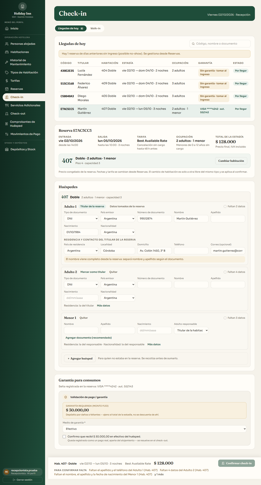
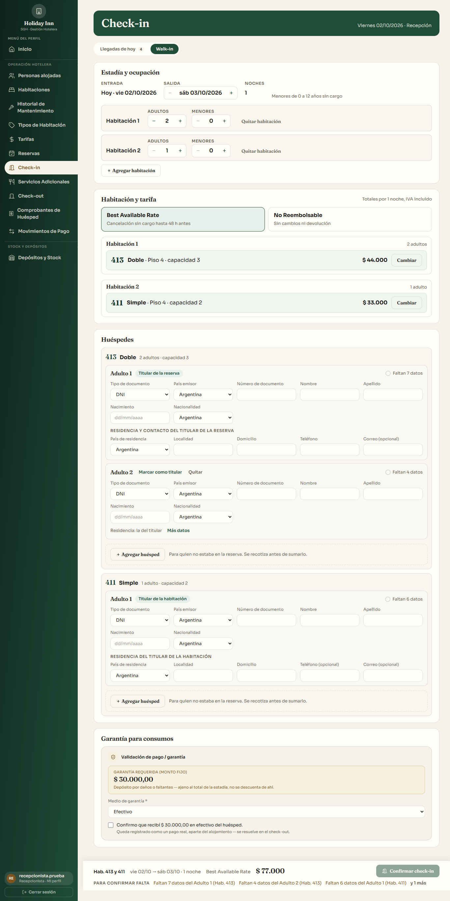

# Rediseño del check-in — Etapa 2 (frontend) · HU-43 a HU-47 y HU-115

Rama `feature/checkin-rediseno-front` → `feature/estadia-ocupantes` (la etapa 1 ya está ahí). Sin merge ni rebase contra `master`.

Reemplaza el asistente de 5 pasos del walk-in y la pantalla con modal del check-in con reserva por **una sola pantalla** con secciones, según el boceto aprobado ([docs/boceto-checkin.html](../docs/boceto-checkin.html)).

## Capturas (1366 px, datos de demo)

| Llegadas de hoy (con una reserva abierta) | Walk-in (dos habitaciones de distinto tipo) |
|---|---|
|  |  |

## Qué hace la pantalla

- **Encabezado** con la fecha de operación (hora argentina) y pestañas **Llegadas de hoy** (con contador) y **Walk-in**. Se conservan `?codigo=` (abre esa reserva) y `?habitacion=` (abre el walk-in con esa habitación elegida si está libre).
- **Llegadas de hoy:** búsqueda con espera, tabla navegable con teclado (flechas y Enter), chip de seña tal como está guardada ("Sin garantía · tomar al ingreso" si no hay) y aviso de reservas anteriores sin ingreso.
- **Con reserva:**
  - Resumen no editable: entrada desde las 14:00, salida hasta las 10:00, noches, tarifa con sus condiciones, ocupación ("Reservado: …" si cambió) y total.
  - Tarjeta por habitación con **Cambiar habitación** (otra libre del mismo tipo, con `excluir=` de las demás) y la marca "Cambiada (era la 270)".
- **Huéspedes:**
  - Filas agrupadas por habitación según la ocupación (adultos primero), precargadas desde las fichas Previstas. Quien reservó va como titular de su habitación, con el aviso de nombre completo en un solo campo.
  - Campos por tipo de fila (adulto, titular, titular de la reserva con teléfono obligatorio, menor con responsable y "Agregar documento (recomendado)").
  - Estado por fila, avisos de edad (13 años para la ocupación, 18 para titular y responsable), **Marcar como titular** y **Motivo** cuando el titular es distinto de quien reservó.
- **Persona que vuelve:** con tipo, país y número completos (400 ms sin tipear) completa la fila y muestra "Ficha encontrada · última estadía". Avisa si la persona está alojada en otra estadía. Nunca consulta números parciales.
- **Agregar / quitar huésped:** con reserva usa la vista previa (`previa-ocupacion`), muestra la diferencia por noche y total, el aviso de no reembolsable y el de ajuste manual perdido. "Confirmar y recotizar" aplica el cambio en pantalla; "Cancelar" deja todo igual. Si se supera la capacidad, ofrece cambiar de habitación. Nada se escribe hasta confirmar.
- **Walk-in:**
  - Salida con − / + (1 a 30 noches) y ocupación por habitación; agregar y quitar habitación.
  - Tarifa única para toda la reserva.
  - Habitaciones libres por tipo con un solo precio (el total de esa ocupación), sin las ya elegidas para otra habitación.
  - El total de la barra sale de `/reservas/cotizar` con todas las habitaciones y es el `totalEsperado`. Se usa el `planTarifarioId` de la respuesta y se envía sin `huesped`.
- **Garantía para consumos:** envuelve `GarantiaFieldset` sin modificarlo, más la línea informativa de la seña. Una sola garantía por reserva.
- **Barra fija:** resumen, "Para confirmar falta" en lenguaje de recepción (hasta 3 más "y N más"; cada ítem lleva al campo y lo enfoca), botón deshabilitado mientras falte algo y durante el envío ("Confirmando…"). Un doble clic no genera dos envíos.
- **Respuestas del servidor:**

  | Respuesta | Dónde se muestra |
  |---|---|
  | 400 `OCUPACION_INVALIDA` / `MOTIVO_TITULAR_REQUERIDO` | En la barra y en el grupo de la habitación |
  | 409 `PRECIO_CAMBIO` | "El precio cambió: antes $ X, ahora $ Y" con **Confirmar con el nuevo total** |
  | 409 `CAMBIO_HABITACION_INVALIDO` | En la tarjeta de la habitación, y se recarga la disponibilidad |
  | 409 `PERSONA_ALOJADA` | En la fila de la persona |

- **Formatos:** fechas dd/mm/aaaa y "vie 02/10"; precios "$ 40.000" con `formatearPrecio` (nuevo en `lib/moneda.js`, solo en el check-in). Ningún "HU" en la interfaz.

### Herencia de residencia y nacionalidad (validarCompleto del backend no se relaja)
- Un adulto no titular hereda el país de residencia del titular de su habitación. Un menor hereda nacionalidad y país de residencia de su adulto responsable.
- La fila lo dice ("Residencia: la del titular · Nacionalidad: la del responsable") y se corrige con **Más datos**. Un valor corregido deja de heredar; los heredados siguen al titular o responsable si cambia.
- El envío lleva siempre los valores reales resueltos. Si el origen no tiene el dato, el faltante aparece en la fila de quien hereda ("Falta la residencia del titular de la Hab. 315").

## Backend (aditivo, sin cambiar mensajes ni status)
- 409 de persona ya alojada: `codigo: "PERSONA_ALOJADA"` y `detalle.personas` con los ids temporales de las filas.
- 409 `CAMBIO_HABITACION_INVALIDO`: `detalle.habitacionIdAnterior`.
- Casos agregados a `test:checkin-rediseno`.

## Datos de demo
`npm run seed:checkin-demo`, con uso documentado en [docs/demo-checkin.md](demo-checkin.md).
- Solo corre contra una base local, con fechas relativas e idempotente.
- Lo de demo se reconoce por documentos `99…` y un manifiesto local por base (`backend/scripts/.demo-checkin.json`, ignorado por Git). `--limpiar` anula con baja lógica.
- Casos a–g pedidos más **h** (3 adultos en no reembolsable). Con 2 adultos (c) la Doble ya los incluye y quitar a uno no cambia el precio con ninguna tarifa; h es el que muestra "Tarifa no reembolsable: el precio no baja".
- **Caso f:** el check-out no emite comprobantes, así que la estadía anterior se arma con el flujo real y se corre 30 días atrás sin romper ninguna numeración. Sus pagos también se corren para no aparecer en la caja de hoy.
- **Dónde se probó:** en `hotelhi_pruebas` recién cargada (catálogo + `seed-tarifas` + `seed-demo-salta`) y en `sgh_gimena`. En las dos, dos corridas seguidas sin duplicar nada y `--limpiar` sin tocar las reservas de `seed-demo-salta`.

## Eliminado
- `check-in/CheckInWalkIn.jsx` (asistente de 5 pasos) y `CheckInConReserva.jsx` (con el input "Documento presentado"), con sus tests.
- `PanelResumenCheckIn.jsx`, `CantidadesOcupantes.jsx` (y test), `bloqueosCheckIn.js` (y test), `validacionOcupantesIngreso.js` y `check-in/validarHuesped.js`.
- `estadia/PersonasWalkIn.jsx` (modal "Persona alojada") y `estadia/ConfirmarAmpliacion.jsx` (y test), más el caso de `EstadiaPanel.test.jsx` que solo probaba `PersonasWalkIn`.
- **Se conservan:** `EstadiaPanel` y `PersonaFormulario` (gestión de alojados), `PaisDocumentoReserva` (lo usa `ReservaWizard`) y `TituloSeccion` (lo usan `GarantiaFieldset` y `BuscarConsumoModal`).

## Pendientes
- **Retirar la ampliación cuando se retire el confirmar sin personas:** `ampliacion.servicio.js` y el parámetro `confirmacionAmpliacion` siguen porque el flujo viejo del backend los usa (se mantiene por compatibilidad).
- **Garantía (Ricardo):** la sección "Garantía para consumos" envuelve `GarantiaFieldset` tal cual; el contenido lo define su módulo.
- **Para Tomás:** `PATCH /api/reservas/:id` sigue sin exigir sesión (hallazgo de la etapa 1).
- **Numeración:** el bloque HU-107 a HU-114 sigue reservado para Ricardo.

## Pruebas
- **Vitest:** 224/224 (14 casos nuevos de la pantalla + lógica pura + formatos). Corrido dos veces seguidas sin fallos.
- **Jest:** 88/88. `pruebas-estadia-consultas.js`: 14/14. `test:checkin-rediseno`: 14 bloques OK. `test:estadia`: OK.
- **Navegador contra `sgh_gimena` con el seed de demo:**
  - 1: un solo `POST /confirmar` aun con doble clic y ningún guardado por persona.
  - 4: quitar con tarifa flexible −$ 4.400 por noche; con no reembolsable "el precio no baja"; cancelar deja todo igual.
  - 6: dos habitaciones, menor a cargo de la titular de la otra habitación, verificado en la base.
  - 8: walk-in Doble + Simple, `excluir` y total igual a `/reservas/cotizar`, 201.
  - 9: precio cambiado con la pantalla abierta, panel antes/ahora y confirmación con el nuevo total.
- **Fallo preexistente intermitente:** `EstadiaPanel.test.jsx > detecta correo repetido…` a veces vence a los 5 s bajo carga, igual que en la línea base.

🤖 Generated with [Claude Code](https://claude.com/claude-code)
