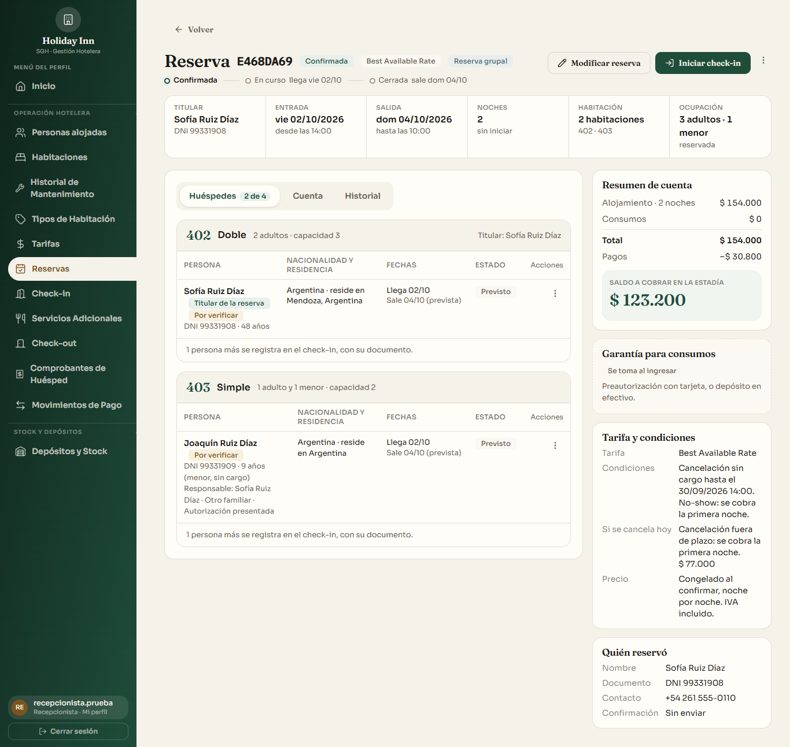
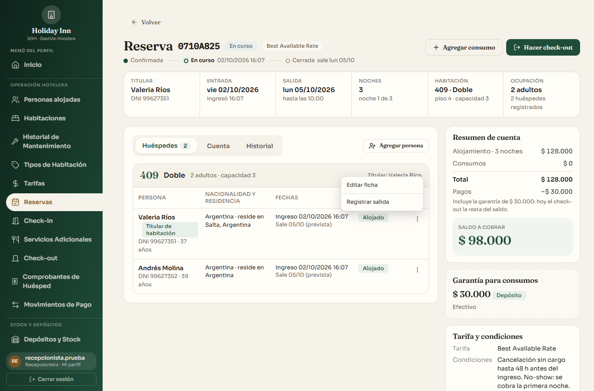
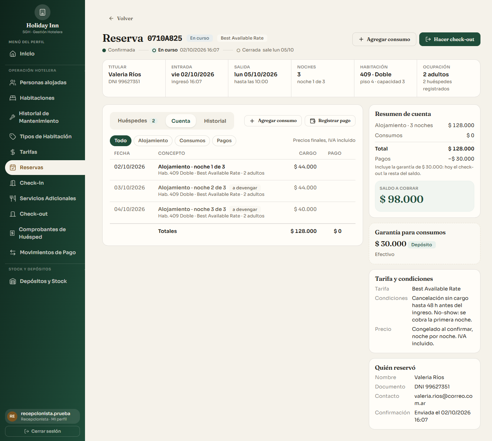
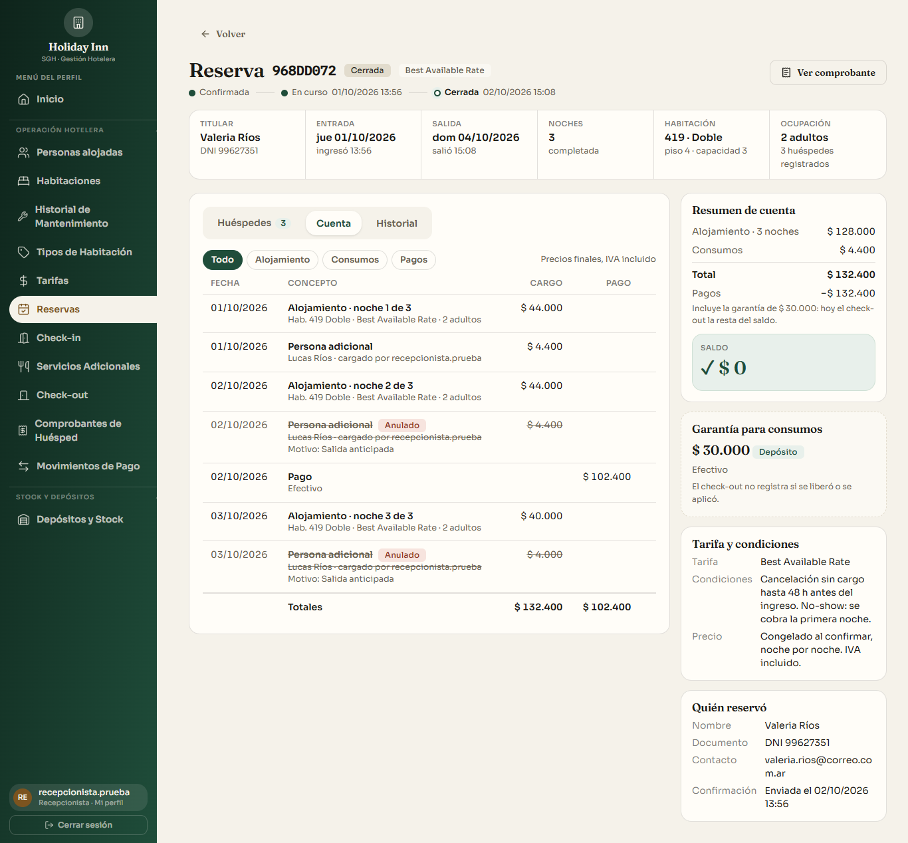
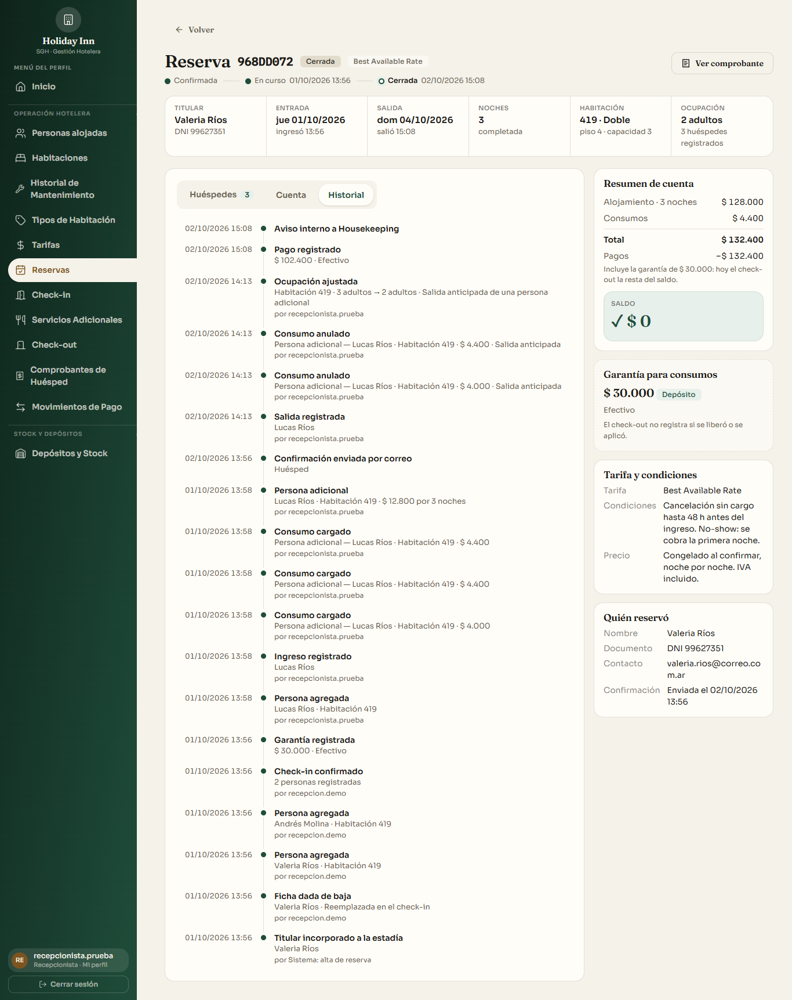
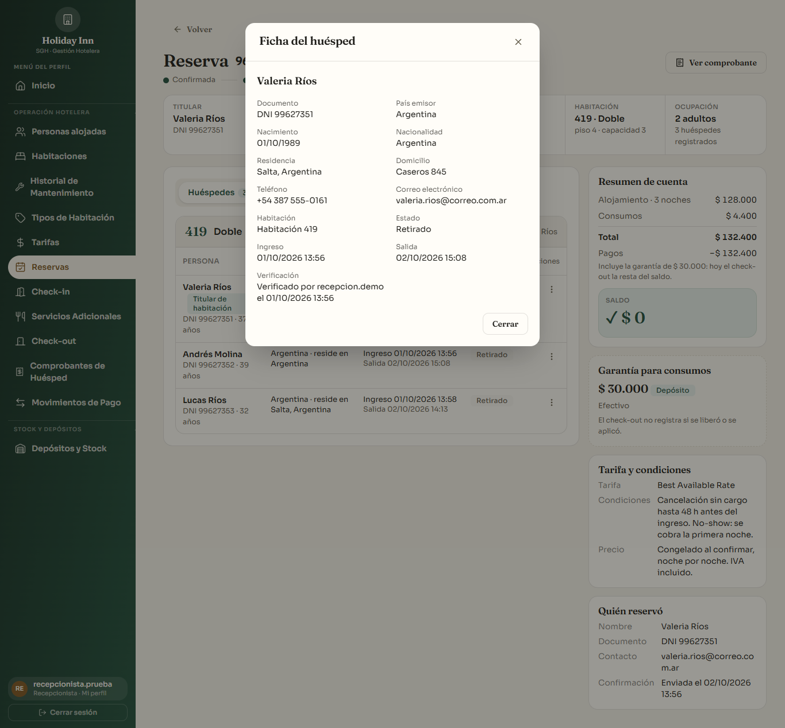
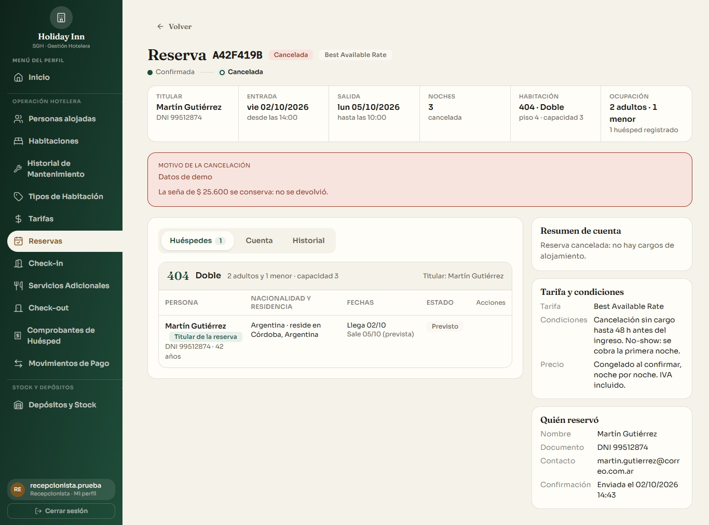
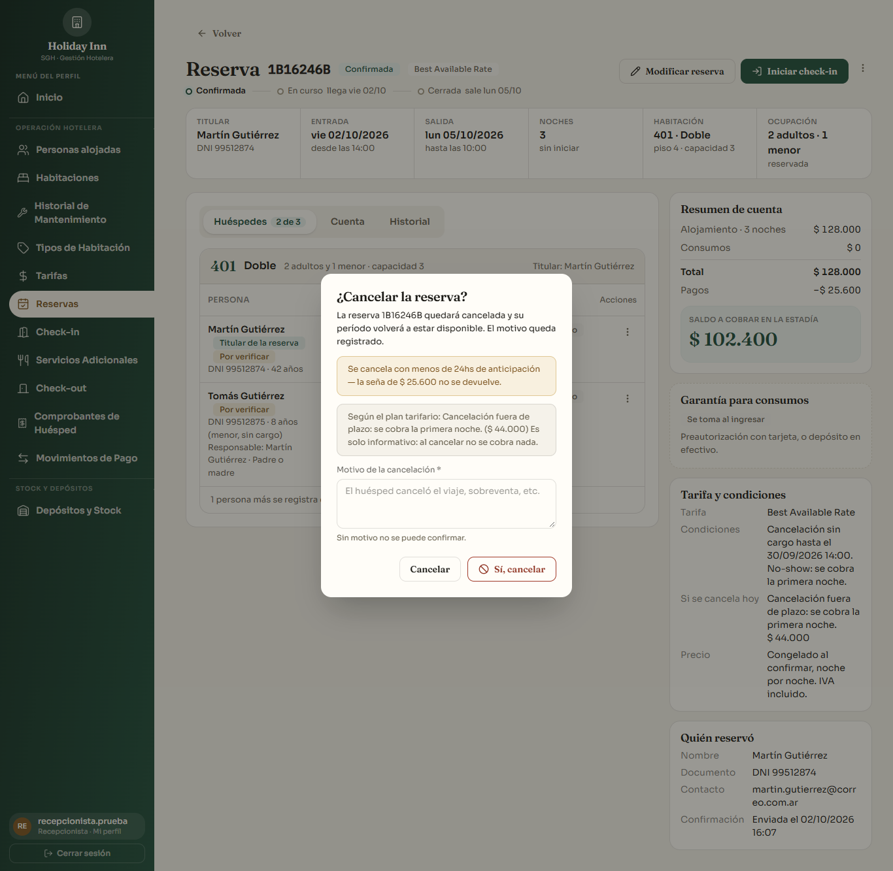
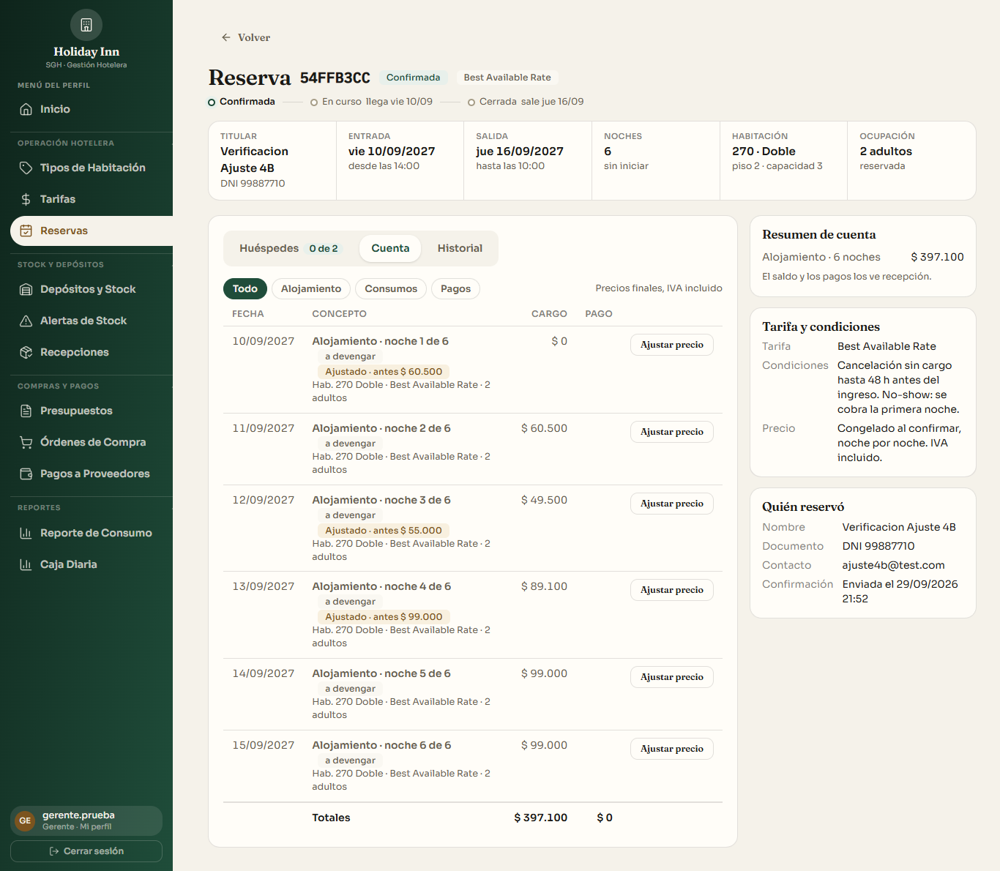

# Detalle de la reserva rediseñado · HU-116

Rama `feature/detalle-reserva`, **sobre `feature/checkin-rediseno-front`** (el PR del check-in todavía no está mergeado: este PR va hacia esa rama). Boceto aprobado: [`boceto-detalle-reserva.html`](boceto-detalle-reserva.html).

## Qué cambia para quien usa la pantalla

Cada dato aparece **una sola vez** y las acciones cambian según el estado de la reserva y el rol.

- **Encabezado**: código, estado, plan, línea de tiempo chica (reemplaza al indicador de pasos grande), acciones y seis datos clave (titular, entrada, salida, noches, habitación, ocupación).
- **Pestañas**: **Huéspedes** (una tabla por habitación, acciones de cada persona en un menú ⋯ que no se corta contra la tabla), **Cuenta** (una sola lista por fecha con filtros y totales) e **Historial**.
- **Columna derecha**: resumen de cuenta, garantía, tarifa y condiciones, quién reservó.
- **Desaparecen** de esta pantalla: las tarjetas «Huésped» y «Estadía», «Habitaciones reservadas», «Servicios adicionales» y «Confirmaciones enviadas» (todo está ahora en el encabezado, la Cuenta, el Historial y la columna derecha).

| Estado | Botones del encabezado | Menú ⋯ |
|---|---|---|
| Confirmada | Modificar reserva · **Iniciar check-in** (con el motivo si todavía no se puede) | Cancelar reserva |
| En curso | Agregar consumo · **Hacer check-out** | — |
| Cerrada | Ver comprobante | — |
| Cancelada | — (muestra el motivo y qué pasó con la seña) | — |
| Gerente | ninguno | — |

**Gerente**: su única acción es **Ajustar precio**, en las filas de alojamiento de la pestaña Cuenta, en los mismos estados de siempre (Confirmada y En curso; solo gerente, motivo obligatorio, auditoría con precio original). Las noches ajustadas se marcan «Ajustado · antes $ X» y el total refleja el precio vigente.

**Cuenta**: alojamiento noche por noche (precio congelado), consumos (con los anulados, tachados y con su motivo) y pagos, ordenados por fecha en hora argentina. Las noches futuras se ven «a devengar». La garantía no figura en la lista porque no es un pago de la cuenta. Desde acá también: Agregar consumo, Registrar pago, Anular un cargo.

**Cancelar**: el diálogo conserva el aviso de la seña (24 hs) y suma la penalidad que corresponde según el plan (`GET /reservas/:id/penalidad`), solo informativa: **no se cobra nada**.

**Ver ficha** (Cerrada): visor de solo lectura con los datos de la ficha, sin lógica nueva.

## Capturas (1366 px, datos de demo)

| | |
|---|---|
|  |  |
|  |  |
|  |  |
|  |  |
|  | |

## Qué se reutilizó (sin duplicar lógica)

- **Resumen de cuenta**: `GET /api/check-out/:id/cuenta` (`consolidarCargos`), la misma llamada de la pantalla de check-out: el saldo coincide exactamente.
- **Lista de cuenta**: noches de la reserva (`ReservaNoche`), `GET /consumos-servicios?reservaId` (incluye anulados con su motivo) y `GET /pagos-estadia?reservaId` (sin concepto «Garantía»).
- **Acciones**: `/check-in?codigo=`, `ReservaWizard`, `ConsumoModal`, `PagoEstadiaWizard` (tal cual), `AjustePrecioModal` (solo se le agregó la prop opcional `nocheInicial` para abrirlo con la noche de la fila elegida), `/check-out/:id`.
- **Estadía**: ficha, mover de habitación, persona adicional, salida y cambio de titular son los flujos de siempre. `EstadiaPanel` (1400 líneas, usado solo en esta pantalla) se partió en `useEstadia` (queries, titular automático y mutaciones), `EstadiaModales`, `PersonaFormulario`, `MoverHabitacion`, `PersonaAdicionalPrevia`, `estadiaUtils` y la pestaña `PestanaHuespedes`, **sin cambiar su comportamiento**. Los tests de esos flujos se trasladaron (`EstadiaFlujos.test.jsx`): cambian solo los pasos para llegar a cada acción (ahora por el menú ⋯ de la persona) y la carga de las pestañas, no lo que prueban.

## Backend: un endpoint de solo lectura

`GET /api/reservas/:id/historial` (`reservas.historial.js`, sesión + roles admin, recepcionista y gerente, como la lectura de estadía). Une en una línea de tiempo, del más reciente al más antiguo, con quién lo hizo:

- eventos de la ficha (alta, edición, documento modificado, verificación, ingreso, salida, baja con su motivo, cambio de habitación, cambio de titular, persona adicional, ocupación ajustada, check-in confirmado…), con los nombres ya resueltos;
- confirmaciones enviadas;
- pagos, con sus anulaciones;
- consumos, con su anulación (fecha, quién y motivo);
- **ajustes manuales de precio**: noche, precio original, precio nuevo, motivo, gerente, fecha y hora.

No agrega columnas ni modifica nada existente (solo una línea en `reservas.routes.js`). No suma datos personales que la pantalla anterior no mostrara. Los cargos de persona adicional no se listan dos veces (ya figuran como consumos).

## Pendientes (no se construyeron: no hay flujo o dato guardado, y no hay migraciones)

1. **Reenviar confirmación**: no existe en el sistema.
2. **Estado «No-show»**: no existe (hoy una reserva que no llega queda Confirmada).
3. **Fecha de cancelación y «penalidad aplicada»**: `Reserva` no guarda la fecha ni la penalidad; cancelar solo conserva o anula la seña. La pantalla muestra el motivo y qué pasó con la seña. Tampoco hay fecha de la anulación de un pago (el historial lo muestra en la fecha del pago, con el motivo).
4. **Fecha de creación y canal de la reserva**: se verificó el esquema: `Reserva` no tiene `creadoEn` ni un campo de origen/canal (el «canal» del cotizador es solo un parámetro de búsqueda, no se guarda). «Quién reservó» muestra «Confirmación enviada el …» (la primera confirmación) y no hay chip de canal en el encabezado.
5. **Cambios de ocupación hechos en el check-in**: no se registran con fecha (el único registro de ocupación con fecha es el de la salida anticipada de una persona adicional, que sí aparece). El cambio de habitación posterior al check-in sí aparece, con su motivo.
6. **Garantía «liberada / aplicada» en el check-out** y **saldo con la garantía restada** — *para Ricardo*: el check-out no registra qué pasó con la garantía y hoy `consolidarCargos` resta la garantía del saldo. La pantalla muestra «Se toma al ingresar», «Depósito / Preautorización $ X · medio · referencia» o «Anulada», y avisa debajo de «Pagos» cuando el saldo incluye la garantía.
7. «Cambiar habitación asignada» antes del check-in (aparece en el boceto) no existe como flujo.
8. «Agregar persona» queda solo para la estadía En curso (como en el boceto): antes del ingreso las personas se cargan en el check-in.

## Cómo se probó

- **Backend**: `npx jest src/modulos/reservas` — historial (orden, anulaciones, ajustes de precio, sin duplicados, detalle roto, consulta solo de la reserva pedida).
- **Frontend**: `npx vitest run` — lógica pura (orden y «a devengar» por fecha argentina, totales, acciones por estado y rol, encabezado), la pantalla (estados, menú por estado y rol, Cuenta, Historial, cancelar, ajustar precio, ficha de solo lectura) y los flujos de estadía trasladados.
- **Navegador** con los datos de demo, a 1366 px, con recepcionista y gerente: las nueve capturas de arriba; abrir cada menú ⋯, «Cambiar titular», «Mover a otra habitación», «Registrar pago» y «Ajustar precio» con la noche preseleccionada.
