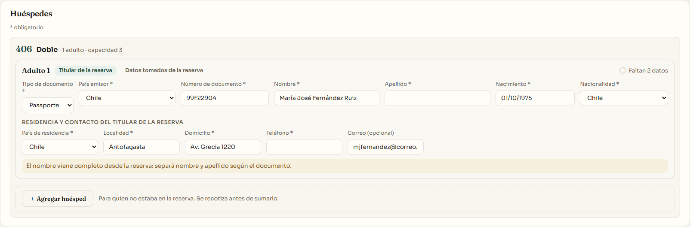
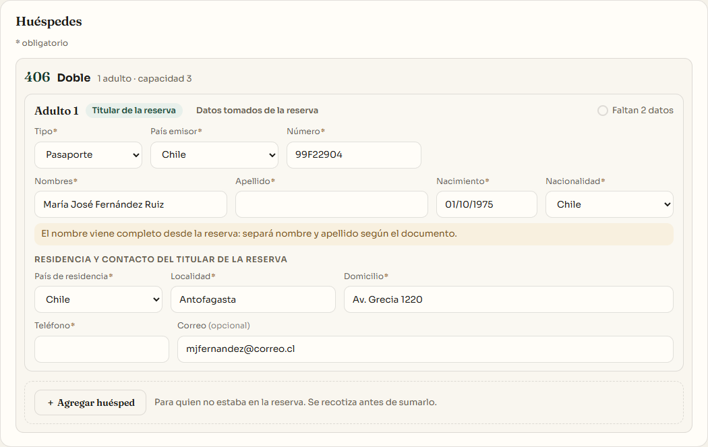
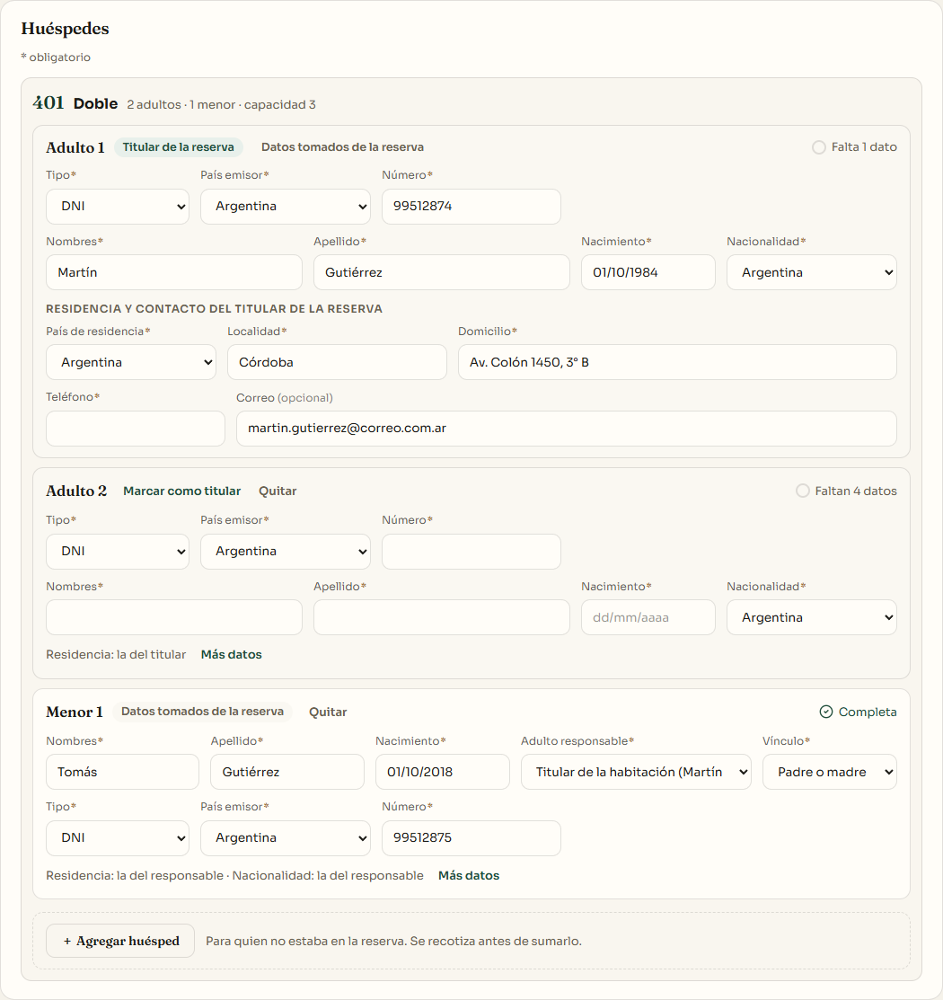
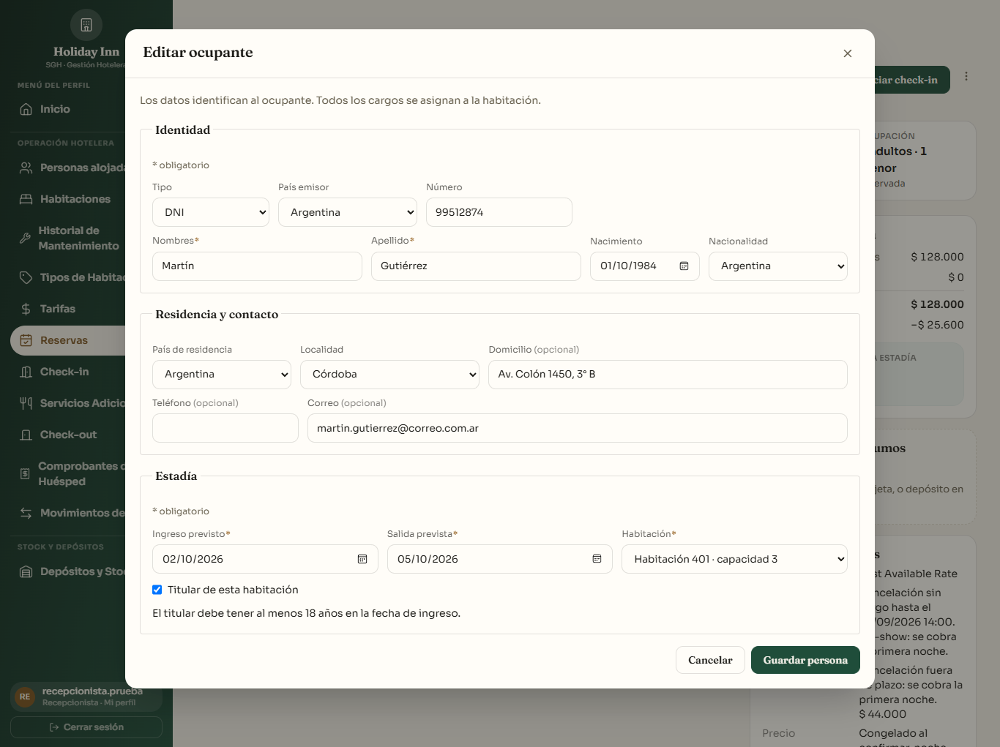

# Formato de las filas de huéspedes (check-in, ficha de ocupante y alta de reserva)

Rama `fix/formato-filas-huespedes`, desde `origin/feature/estadia-ocupantes` (los PR de `feature/checkin-rediseno-front` y `feature/detalle-reserva` ya están mergeados ahí). PR hacia `feature/estadia-ocupantes`.

Solo frontend: no cambia la lógica, las validaciones ni los textos de faltantes.

## Qué cambia

- **Filas compartidas** (`frontend/src/componentes/FilaFicha.jsx`), usadas por las tres pantallas:
  - Documento: Tipo · País emisor · Número.
  - Identidad: Nombres (2fr) · Apellido (2fr) · Nacimiento · Nacionalidad.
  - Titular: Residencia (País de residencia · Localidad · Domicilio) y Contacto (Teléfono · Correo).
  - Menor: Nombres · Apellido · Nacimiento · Adulto responsable · Vínculo en una fila; Autorización y Documento debajo cuando corresponda.
- **Grillas con columnas `minmax`/`fr` y container queries:** responden al ancho del contenedor, no al de la ventana. Entre 1366 y 1920 px se ven completas. En un contenedor más angosto pasan a 2 o 3 columnas, en el mismo orden. No hay scroll horizontal.
- **Controles iguales:** todos los inputs y selects miden 40 px, con el mismo padding, radio y tamaño de letra. Quedan alineados abajo (`items-end`).
- **Rótulos cortos que no se parten:** "Tipo", "País emisor", "Número", "Nombres", "Apellido", "Nacimiento", "Nacionalidad", "Vínculo".
  - El asterisco va pegado al rótulo, en el color de acento y un poco más chico.
  - Se muestra "(opcional)" donde corresponde.
  - En la ficha de ocupante el nombre accesible (`aria-label`) no cambió, por ejemplo "Número de DNI".
- **Aviso "separá nombre y apellido":** queda inmediatamente debajo de la fila de identidad; los demás avisos siguen al final de la fila.
- **Ficha de ocupante:**
  - el modal pasa a `max-w-5xl` para que la fila entre completa;
  - Nacionalidad se muestra en la fila de identidad, igual que en el check-in;
  - la justificación sin documento va en su propia línea.
- **Alta de reserva de mostrador:** mismas filas y rótulos. Conserva su orden (Nombres, Apellido y Nacimiento; después Tipo, País emisor y Número; después Correo y canal de confirmación).
- **`Input`:** el reemplazo del rótulo "Contacto…" por "Correo electrónico *" solo se aplica cuando el rótulo es texto, porque ahora puede ser un elemento `<Rotulo>`. Para un rótulo de texto el comportamiento es el mismo.

## Capturas (antes / después)

En `docs/capturas-checkin/formato-filas/`, con el seed de demo en `sgh_gimena`:

| | 1366 px | 1920 px |
|---|---|---|
| Check-in, caso e (aviso de nombre completo) | `filas-checkin-caso-e-antes-1366.png` → `filas-checkin-caso-e-despues-1366.png` | `…-antes-1920.png` → `…-despues-1920.png` |
| Check-in, caso a (titular, acompañante y menor) | `filas-checkin-caso-a-antes-1366.png` → `filas-checkin-caso-a-despues-1366.png` | `…-antes-1920.png` → `…-despues-1920.png` |
| Ficha de ocupante (Editar ficha, detalle de la reserva) | `ficha-ocupante-antes-1366.png` → `ficha-ocupante-despues-1366.png` | `…-antes-1920.png` → `…-despues-1920.png` |

También hay capturas `…-despues-1024.png` de los mismos casos: a 1024 px las filas pasan a dos columnas sin scroll horizontal.

| Antes (caso e, 1920 px) | Después (caso e, 1366 px) |
|---|---|
|  |  |

| Después: caso a, 1366 px | Después: ficha de ocupante, 1366 px |
|---|---|
|  |  |

## Pruebas

Vitest 285/285. Los tests que buscaban rótulos viejos ahora buscan los nuevos: "Nombres", "Número", "Vínculo", con el asterisco pegado (por ejemplo, "Nombres*").

🤖 Generated with [Claude Code](https://claude.com/claude-code)
